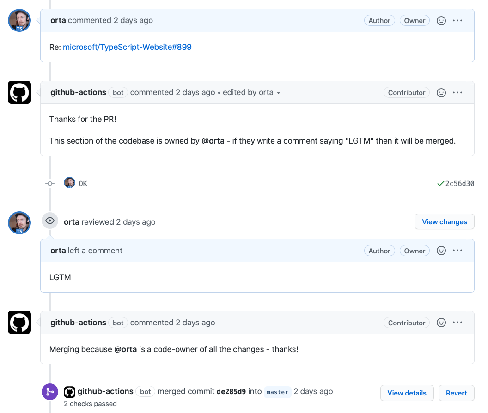

A GitHub action that lets code-owners merge PRs via a comment.

This action uses the standardized structure of [a CODEOWNERS file](https://github.blog/2017-07-06-introducing-code-owners/) to handle the access controls. 



## A simple example

So, with this file at: `.github/CODEOWNERS`:

```sh
README.md @orta
```

If a PR contained _only_ a change to the `README.md` - this action would say that "@orta has the ability to merge by commenting 'LGTM'".

Then, when/if this happens the GitHub Action will merge for you.

## A real-world example

`.github/CODEOWNERS`:

```sh
# Collaborators for Japanese Translation of the Website
packages/playground-examples/copy/ja/**/*.md @sasurau4 @Quramy @Naturalclar @Takepepe @orta
packages/tsconfig-reference/copy/ja/**/*.md @sasurau4 @Quramy @Naturalclar @Takepepe @orta
packages/typescriptlang-org/src/copy/ja/**/*.md @sasurau4 @Quramy @Naturalclar @Takepepe @orta
packages/documentation/copy/ja/**/*.ts @sasurau4 @Quramy @Naturalclar @Takepepe @orta
```

This allows any of `@sasurau4`, `@Quramy`,  `@Naturalclar`, `@Takepepe` or `@orta` to merge PRs which affect their areas of the translation process in the TypeScript Website repo. Code owners can use a [review](https://github.com/orta/code-owner-self-merge/pull/3), or a [comment](https://github.com/orta/code-owner-self-merge/pull/1) to merge.

## Setting It Up

You want a unique workflow file, e.g. `.github/workflows/codeowners-merge.yml`

```yml
name: Codeowners merging
on:
  pull_request_target: { types: [opened] }
  issue_comment: { types: [created] }
  pull_request_review: { types: [submitted] }

jobs:
  build:
    runs-on: ubuntu-latest

    steps:
      - uses: actions/checkout@v1
      - name: Run Codeowners merge check
        uses: OSS-Docs-Tools/code-owner-self-merge@1.5.2
        env:
          GITHUB_TOKEN: ${{ secrets.GITHUB_TOKEN }}
```

Then you should be good to go.

### Security

We force the use of [`pull_request_target`](https://github.blog/2020-08-03-github-actions-improvements-for-fork-and-pull-request-workflows/) as a workflow event to ensure that someone cannot change the CODEOWNER files at the same time as having that change be used to validate if they can merge.

### Extras

You can use this label to set labels for specific sections of the codebase, by having square brackets to indicate labels to make: `[label]`

```sh
# Collaborators for Spanish Translation of the Website
packages/playground-examples/copy/es/**/*.md @KingDarBoja [translate] [es]
packages/playground-examples/copy/es/**/*.ts @KingDarBoja [translate] [es]
packages/tsconfig-reference/copy/es/**/*.md @KingDarBoja [translate] [es]
packages/typescriptlang-org/src/copy/es/**/*.ts @KingDarBoja [translate] [es]
packages/documentation/copy/es/**/*.ts @KingDarBoja [translate] [es]
```

## Config

There are four options available at the moment:

- `cwd`, which can be used to determine the root folder to look for CODEOWNER files in.
- `merge_method`, which can be `merge` (default), `squash` or `rebase`, depending on what you want the action to do.

```yml
- name: Run Codeowners merge check
  uses: OSS-Docs-Tools/code-owner-self-merge@v1
  env:
    GITHUB_TOKEN: ${{ secrets.GITHUB_TOKEN }}
  with:
    cwd: './docs'
    merge_method: 'squash'
```

Then 2 for handling fallbacks on PRs which aren't able to be maintained by anyone in the CODEOWNERs:

- `if_no_maintainers_add_label` - A label to add which denotes it is a maintainers PR to handle
- `if_no_maintainers_assign` - A string of `@` prefixed GitHub usernames, separated by spaces which denotes who should be assigned to PRs which don't get a CODEOWNER.

```yml
- name: Run Codeowners merge check
  uses: OSS-Docs-Tools/code-owner-self-merge@v1
  env:
    GITHUB_TOKEN: ${{ secrets.GITHUB_TOKEN }}
  with:
    merge_method: 'squash'
    if_no_maintainers_add_label: 'maintainers'
    if_no_maintainers_assign: '@orta @sandersn'
```

### Dev

Use `npx jest --watch` to run tests.

### Deploy

Use the GH UI to make a tag and release
